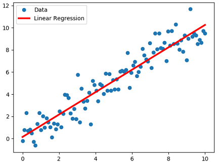
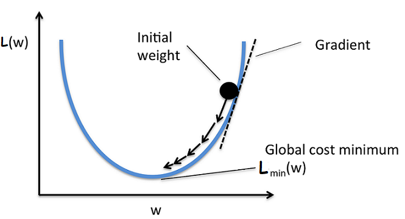

# StochasticGradientDescent 

A custom implementation of Stochastic Gradient Descent for Linear Regression that optimizes the weights **W(i)** of each component and the bias **b** term.

# Gradient Descent:

Gradient Descent is an iterative optimization algorithm that can be used to converge to an optimal value easily with the use of modern computaional power.
  * The update equation for every iteration is, **x(i) = x(i-1) - r \* [df/dx]_x(i-1)** ; **i : 1 -> n**.
  * It mainly depends on the **learning rate** (or) **step size** denoted by **"r"**.
  * The **learning rate** tells how fast to converge to the optimal value. So giving a right value of **"r"** matters.
  * If the right value of **"r"** ain't given then the updation might jump over optimal value(min) and we'll not be converging at the right solution. Hence need to check with different values of **"r"**.

Let us consider a simple linear regression,
  
  * **Objective :** Find the line/plane that best fits the data as,
  
  
  * The dataset is **D = <x_i, y_i> ; x_i ∈ R^d ; y_i ∈ R**. Here **d** is for # of dimensions.
  * We can find the line/plane that fits the real values data of form **y_i = W.T\*x_i + B** for given **x_i**. Here **B** is for bias. 
  * Then we've **Mean Squared Error(MSE)** = **sum( [y_i - (W.T\*x_i + B)]^2 ) / n** ; **i : 1 -> n**.
  * The optimal weight vector will be **W\* = argmin(W) sum( [y_i - (W.T\*x_i + B)]^2 ) / n** i.e the one which gives minimum sum of squared errors.

We can write the optimization problem **W\* = argmin(W) sum( [y_i - (W.T\*x_i + B)]^2 ) / n** as,

**L(W) = [ 𝜮(y_i - (W.T\*x_i + B))^2 ] / n** ; **i : 1 -> n**.

Then the vector differentiation or grad of **L(w)** is **𝞩_w L = 𝜮 { 2\*(y_i - (W.T\*x_i + B))(-x_i) } / n**

# Steps for finding Optimal weight:
1. Initialize the weight vector **W(0)** with random values.
2. repeat until **W(k-1)** and **W(k)** doesn't change much:
    * **W(i) = W(i-1) - r\*𝜮 { (-2\*x_i)\*(y_i - (W(i-1)\*x_i + B)) } / n ; i : 1 -> n**
3. Declare **W\* = W(k-1)**
4. Similarly step 2 & 3 can be followed to get the optimal value of bias **"B"** term where instead of differentiating with respect to **W** we do it with **B**.
    
But the problem with gradient descent is it takes a lot of time calculating **𝜮 { (-2\*x_i)\*(y_i - (W.T\*x_i + B)) } / n** for every iteration as **i : 1 -> n**.

To overcome this we can select **K** random points instead of total **n** points at each iteration for the above summation.

This technique of selecting **K** random points at each iteration is known as **Stochastic Gradient Descent**. Stochastic here is for randomization.
  * So here the updation looks like,
    **SGD : W(i) = W(i-1) - r\*𝜮 { (-2\*x_i)\*(y_i - (W(i-1)\*x_i + B)) } / K** with **i: 1 -> K**

It also can be seen that **W\* of GradientDescent** is almost equal to **W\* of Stochastic Gradient descent** but with some increased number of iterations in **Stochastic Gradient descent** for the convergence of optimal value.

__
**K** is often called as batch size in **Stochastic Gradient descent(SGD)**.
  * If **K=1** then it's simple SGD.
  * If **1<K<<n** then it's batch SGD with batch size = K.
  
Hence, **Stochastic Gradient descent(SGD)** is one of the most important optimization algorithm in Machine Learning.

# Note:
Again gradient descent can stuck in local optima if the function to be optimized is a **non-convex**.

In the above exmaple of linear regression we were able to find the optimal value without being stuck at local optima as the sum of squared errors is a **convex** function. 
